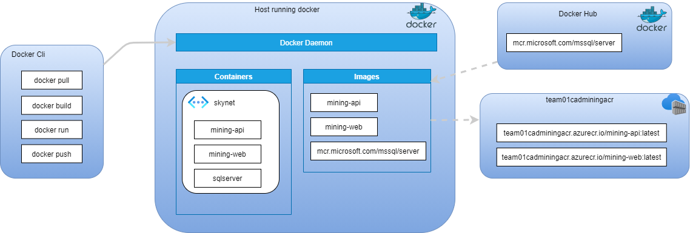

# Container adventure day
Container Adventure Day is an interactive team-based and individual learning experience to learn more about on how to work with containers in Azure.

Participants will be working as teams to complete increasingly complex. Subject Matter Experts are available to guide the teams through this journey if needed. The Game Play itself will have a four-phase narrative around Development, Optimizing, Deploy and Scale. 

The target audience are for this event are Software Engineers, Software Developers, Cloud Architects and DevOps Engineers. 

You should have a basic understanding of Microsoft Azure and Docker. Kubernetes experie is helpful. A highly recommended starting point is [Microsoft Certified: Azure Fundamentals](https://docs.microsoft.com/en-us/learn/certifications/azure-fundamentals/), [Administer containers in Azure](https://docs.microsoft.com/en-us/learn/paths/administer-containers-in-azure/) and [Introduction to Docker containers](https://docs.microsoft.com/en-us/learn/modules/intro-to-docker-containers/) .


## Story
Skynet is infiltrating your datacenter and is taking over your mining robots one by one and is using the resources for its own use.
To fight back you need to make your application more robust and resilient by containerizing it. Someone created a VMs running Docker in Azure and also started the work for containerizing the applications. 

## Overview
Mining applications consists of a backend application called mining-api and a frontend application called mining-web. To run the mining application a sql database is needed. We will run te database as a container. We will pull the sql server image from docker hub and run it locally. In this challange we will build the mining-api and minin-web and try it locally. If everything works fine we will then push the image to a private registry in azure.


 
### Getting started. Create a code space
[GitHub Codespaces](https://docs.github.com/en/codespaces) is a development environment that's hosted in the cloud. It's a good way way to work with your code without installing anything on your local machine. Docker and many other things are already there for you. Just create a Codespace instead of cloning it to your local machine 


Your Codespace "times out" after 30 minutes if you are not using it, you can change the timeout [this way](https://docs.github.com/en/codespaces/customizing-your-codespace/setting-your-timeout-period-for-codespaces)

If you use Codespaces make sure to run this command in the terminal windows to install the latest version of the Docker CLI:
```
curl -L https://raw.githubusercontent.com/docker/compose-cli/main/scripts/install/install_linux.sh | sh
```
After you run the command start a new terminal Window in Codespaces.

